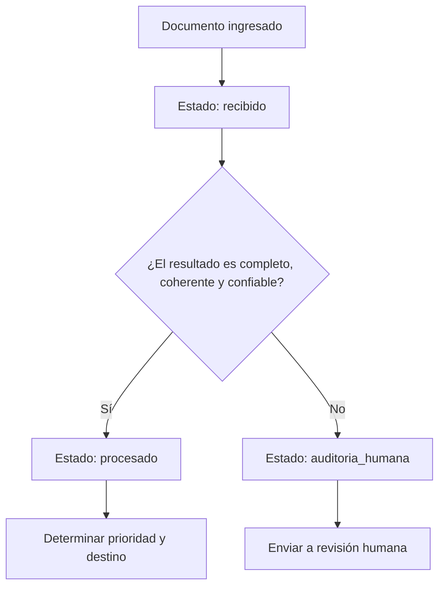

# MediFlow — Matriz de estados lógicos del documento

**Responsable:** Laura Paiva — Data Analyst
**Sprint:** Sprint 1 — Infraestructura y Bases
**Versión:** 1.0

## 1. Objetivo

Definir de manera clara los estados que puede atravesar un documento clínico dentro de MediFlow y las reglas que determinan cuándo debe cambiar de un estado a otro.

Durante este Sprint se contemplan las siguientes transiciones principales:

- `Recibido → Procesado`
- `Recibido → Auditoría humana`

La matriz servirá como base para que, en los siguientes Sprints, el backend, la inteligencia artificial y el almacenamiento en OCI utilicen los mismos criterios de decisión.
## 2. Estado: Recibido

El estado `recibido` indica que el documento ingresó correctamente a MediFlow y se encuentra disponible para iniciar el procesamiento automático.

En este estado, el sistema todavía no ha determinado si el documento es correcto, urgente, ambiguo o si requiere revisión humana.

### Condiciones para ingresar al estado Recibido

Un documento pasa a `recibido` cuando:

- El sistema recibe correctamente el archivo o contenido.
- El formato recibido es aceptado por MediFlow.
- Se genera o registra un identificador único para el documento.
- El documento queda disponible para iniciar su procesamiento.
- El archivo puede ser almacenado en la ubicación correspondiente de OCI, por ejemplo `recibidos/`.

### Qué todavía no significa este estado

Estar en estado `recibido` no confirma que:

- El documento sea legible.
- La clasificación sea correcta.
- Los datos clínicos estén completos.
- La extracción de información sea válida.
- La prioridad haya sido determinada.
- El documento pueda continuar sin auditoría humana.

### Posibles estados siguientes

Desde `recibido`, el documento puede avanzar a:

- `procesado`
- `auditoria_humana`
## 3. Estado: Procesado

El estado `procesado` indica que MediFlow completó correctamente el procesamiento automático del documento y obtuvo un resultado suficientemente completo, coherente y confiable para continuar el flujo sin revisión humana previa.

### Condiciones para pasar de Recibido a Procesado

Un documento puede pasar de `recibido` a `procesado` cuando:

- El contenido del documento puede ser interpretado.
- El tipo de documento puede ser identificado.
- Los datos clínicos requeridos para ese tipo de documento están presentes.
- No existen contradicciones críticas entre los datos extraídos.
- La salida estructurada puede representarse correctamente en formato JSON.
- El nivel de confianza cumple el umbral definido por el equipo.
- La prioridad del documento puede determinarse.
- El destino de enrutamiento puede determinarse.
- No se activa ninguna condición que requiera auditoría humana.

### Acciones esperadas al quedar Procesado

Cuando el documento alcanza el estado `procesado`:

- Se registra el estado como `procesado`.
- Se conserva la clasificación del documento.
- Se almacenan los datos extraídos.
- Se registra la prioridad.
- Se registra el score de confianza.
- Se determina el destino correspondiente.
- El resultado puede almacenarse en la ubicación `procesados/` de OCI.
## 4. Estado: Auditoría humana

El estado `auditoria_humana` indica que el documento no puede continuar de forma automática porque existe alguna condición que impide considerar el resultado suficientemente completo, coherente o confiable.

En estos casos, el documento debe ser revisado por una persona antes de continuar con el flujo.

### Condiciones para pasar de Recibido a Auditoría humana

Un documento puede pasar de `recibido` a `auditoria_humana` cuando:

- El documento es ilegible, borroso, cortado o incompleto.
- No puede identificarse con claridad el tipo de documento.
- Faltan datos clínicos relevantes.
- Existen datos contradictorios.
- La clasificación es ambigua.
- El score de confianza queda por debajo del umbral definido por el equipo.
- La salida estructurada presenta errores que impiden considerarla válida.
- No puede determinarse un destino de forma segura.
- Se activa una regla que exige revisión manual.

### Acciones esperadas al quedar en Auditoría humana

Cuando el documento alcanza el estado `auditoria_humana`:

- Se registra el estado como `auditoria_humana`.
- Se conserva la información extraída hasta ese momento.
- Se registra el motivo por el cual requiere revisión.
- El documento se deriva a una cola de revisión manual.
- El resultado puede almacenarse en la ubicación `auditoria_humana/` de OCI.
- El sistema no debe inventar ni completar automáticamente información faltante.
## 5. Matriz de estados y transiciones

| Estado actual | Condición o evento | Estado siguiente | Acción esperada |
|---|---|---|---|
| Fuera del sistema | El documento es recibido correctamente por MediFlow | `recibido` | Registrar el documento y dejarlo disponible para procesamiento |
| `recibido` | El documento puede interpretarse, clasificarse y extraerse con suficiente confianza; los datos requeridos están presentes y no existen contradicciones críticas | `procesado` | Registrar el resultado, determinar prioridad y destino, y continuar el flujo automático |
| `recibido` | El documento es ilegible, incompleto, ambiguo, contradictorio, presenta baja confianza o no puede validarse correctamente | `auditoria_humana` | Registrar el motivo de revisión y enviar el documento a la cola de auditoría humana |

## 6. Ejemplos de aplicación

### Ejemplo 1 — Caso normal

**Tipo de documento:** Receta médica.

**Situación:**
El documento es legible y contiene los datos necesarios del paciente, del profesional y de la medicación. La información extraída es coherente y el sistema puede determinar correctamente su destino.

**Transición:**

`recibido → procesado`

**Resultado esperado:**
El documento continúa automáticamente hacia el destino correspondiente sin necesidad de auditoría humana.

---

### Ejemplo 2 — Caso urgente

**Tipo de documento:** Informe de estudio.

**Situación:**
El informe contiene un hallazgo clínico urgente. El documento es legible, los datos están completos y el sistema puede interpretar correctamente el contenido y determinar su prioridad.

**Transición:**

`recibido → procesado`

**Prioridad:**
Urgente.

**Resultado esperado:**
El documento es procesado y enviado al destino de urgencias correspondiente.

> Un documento urgente no necesariamente requiere auditoría humana. Si la información es clara y confiable, puede continuar como `procesado`.

---

### Ejemplo 3 — Caso ambiguo

**Tipo de documento:** Documento clínico digitalizado.

**Situación:**
La imagen está borrosa y parte de la información importante no puede leerse con claridad. El sistema no puede identificar con suficiente seguridad algunos datos clínicos.

**Transición:**

`recibido → auditoria_humana`

**Resultado esperado:**
El documento se deriva a revisión humana para evitar que el sistema tome una decisión con información insuficiente.
## 7. Aplicación de la lógica según el tipo de documento

La lógica general de estados es la misma para todos los documentos, pero las condiciones que permiten considerar un documento suficientemente completo pueden variar según su tipo.

| Tipo de documento | Ejemplos de información relevante | Si la información es clara y suficiente | Si existe ambigüedad o información crítica faltante |
|---|---|---|---|
| Receta médica | Paciente, profesional, medicamento, dosis o indicación | `procesado` | `auditoria_humana` |
| Informe de estudio o laboratorio | Paciente, tipo de estudio, resultado o conclusión | `procesado` | `auditoria_humana` |
| Orden de procedimiento | Paciente, profesional solicitante, procedimiento o estudio | `procesado` | `auditoria_humana` |
| Epicrisis o informe de alta | Paciente, diagnóstico principal, resumen o indicación de alta | `procesado` | `auditoria_humana` |
| Certificado médico | Paciente, profesional, fecha e indicación correspondiente | `procesado` | `auditoria_humana` |
| Imagen o documento digitalizado | Información clínica identificable según el tipo de documento | `procesado` | `auditoria_humana` |

> Los campos exactos obligatorios y opcionales deberán confirmarse cuando se defina el contrato JSON oficial en el Sprint 2.
## 8. Diagrama de estados

## 9. Decisiones pendientes para los siguientes Sprints

La presente matriz define la lógica funcional inicial de los estados. Algunos criterios deberán completarse cuando avance la integración del sistema.

Quedan pendientes:

- Confirmar el contrato JSON oficial definido por el equipo.
- Confirmar los nombres exactos y tipos de datos de los campos.
- Identificar qué campos serán obligatorios y cuáles opcionales.
- Definir el umbral numérico del score de confianza.
- Validar cómo se representarán los errores o datos faltantes.
- Integrar estas reglas con el motor de IA, backend y OCI.

Estas definiciones serán necesarias para implementar la validación estructurada de la salida del LLM durante el Sprint 2.

## 10. Checklist de aceptación

- [x] Se definió el estado `recibido`.
- [x] Se definió el estado `procesado`.
- [x] Se definió el estado `auditoria_humana`.
- [x] Se documentó la transición `recibido → procesado`.
- [x] Se documentó la transición `recibido → auditoria_humana`.
- [x] Se definieron las principales condiciones de cada transición.
- [x] Se incluyeron ejemplos de caso normal, urgente y ambiguo.
- [x] Se incluyó una matriz de estados.
- [x] Se incluyó un diagrama del flujo.
- [x] Se identificaron decisiones pendientes para los siguientes Sprints.